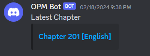

# discord-noti
A discord bot that notifies the users of a server when a new chapter releases for the **One Punch Man** manga. 

Each day it will pull chapter information from [r/OnePunchMan](https://www.reddit.com/r/OnePunchMan/) discussion posts related to the latest chapters. It only checks once a day to limit the requests that would result from immediate notification. It also includes limited slash command functionality for single-use immediate updates.

Built using Python, the [Reddit API](https://www.reddit.com/dev/api/) with [AsyncPRAW](https://asyncpraw.readthedocs.io/en/stable/)/[PRAW](https://praw.readthedocs.io/en/stable/index.html), and the [Discord Dev Platform](https://discord.com/developers/docs/intro) with [Pycord](https://github.com/Pycord-Development/pycord).

## Install and Setup
TODO: Add depth to the set up steps/finish it

1. Setting up Reddit: [PRAW's Quickstart](https://praw.readthedocs.io/en/latest/getting_started/quick_start.html)
    - Create a new reddit application [here](https://www.reddit.com/prefs/apps)
    - Note the Client ID and Client Secret

2. Setting up Discord:
    - Create a discord bot account following these [steps from discord.py](https://discordpy.readthedocs.io/en/stable/discord.html) and invite the bot to your server
        - Note the bot's token

3. Prepare a `.env` with required keys and values

Installation:

`pipenv install`

Starting the bot:

`pipenv run python main.py`

The bot should appear online within the server after starting.

## Background and Reflection
I'm a fan of both anime and manga and I like to keep up with the latest releases of my favorite series and serializations, like **One Punch Man (OPM)**. I had previously used a [Twitter bot account](https://twitter.com/opmreddit) for OPM notifications, but it had stopped updating in May 2023. Unfortunately for me, OPM isn't the greatest with consistency when it comes to chapter releases, it may be bi-weekly for one chapter and bi-monthly for the next. So, my motivation here was to make my own bot to notify me so that I can keep up to date with new chapters. 

In the initial iteration of this project, I didn't use Discord at all, but rather I used system notifications on computer startup to notify me of new chapters. I then decided to incorporate a Discord bot with hopes of learning the foundations of how to make a bot for future projects. 

The most challenging part of making this bot was learning and applying both the PRAW and Pycord libraries used to interact with the APIs. I spent most of my time reading documentation and troubleshooting errors as they occurred. My experiences with working my way through them and their documentation was very different from those that I have worked with before. It may be because these libraries had less additional resources when compared to other widely used libraries.

Right now, the bot is hosted on my local machine, but I have looked at hosting solutions such as [Oracle Cloud](https://www.oracle.com/cloud/). The bot itself is intended for personal use and is light enough for free tier hosting.

## Plans
- If I'm able to secure an Oracle instance, I would ideally like to host my bot there.
- Add updates for other serializations with long release schedules.
    - This may require the [MangaDex API](https://api.mangadex.org/docs/), as the current solution for using reddit is specific to OPM.
- Add more substance and styling to the bots messages regarding chapter information
